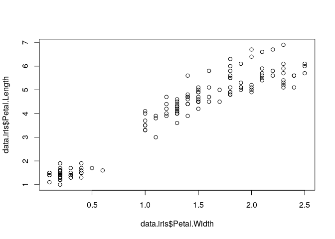

Iris Modeling
================
<a href='https://github.com/natelangholz'> Nate Langholz</a>

``` r
knitr::opts_chunk$set(warning = FALSE, message = FALSE)
```

**Project Name**: Iris Modeling Development Work  
**Knitted Date**: 2019-05-21

# Intro

This is a Rmarkdown file that shows some exploratory data analysis and
model creation of a simple linear model using the Iris data set.

## Exploratory Data Analysis

### Load Data

``` r
# load the dataset
data.iris <- iris
```

### Plot

``` r
#plot the relationship between two variables
plot(data.iris$Petal.Width,data.iris$Petal.Length)
```

<!-- -->

### Correlation

This is the correlation between petal width and length. It is quite
high\!

``` r
#correlation between variables
cor(data.iris$Petal.Width,data.iris$Petal.Length)
```

    ## [1] 0.9628654

## Modeling

### Create Models

Let’s now create two linear models and select one as a final model to
save to use in our API.

``` r
# create a first model
model_1 <- lm(Petal.Length ~ Petal.Width, data = data.iris)
summary(model_1)
```

    ## 
    ## Call:
    ## lm(formula = Petal.Length ~ Petal.Width, data = data.iris)
    ## 
    ## Residuals:
    ##      Min       1Q   Median       3Q      Max 
    ## -1.33542 -0.30347 -0.02955  0.25776  1.39453 
    ## 
    ## Coefficients:
    ##             Estimate Std. Error t value Pr(>|t|)    
    ## (Intercept)  1.08356    0.07297   14.85   <2e-16 ***
    ## Petal.Width  2.22994    0.05140   43.39   <2e-16 ***
    ## ---
    ## Signif. codes:  0 '***' 0.001 '**' 0.01 '*' 0.05 '.' 0.1 ' ' 1
    ## 
    ## Residual standard error: 0.4782 on 148 degrees of freedom
    ## Multiple R-squared:  0.9271, Adjusted R-squared:  0.9266 
    ## F-statistic:  1882 on 1 and 148 DF,  p-value: < 2.2e-16

Let’s create a second model.

``` r
# create a second model
model_2 <- lm(Petal.Length ~ Petal.Width + Sepal.Length, data = data.iris)
summary(model_2)
```

    ## 
    ## Call:
    ## lm(formula = Petal.Length ~ Petal.Width + Sepal.Length, data = data.iris)
    ## 
    ## Residuals:
    ##      Min       1Q   Median       3Q      Max 
    ## -1.15506 -0.21920 -0.02115  0.25986  1.35204 
    ## 
    ## Coefficients:
    ##              Estimate Std. Error t value Pr(>|t|)    
    ## (Intercept)  -1.50714    0.33696  -4.473 1.54e-05 ***
    ## Petal.Width   1.74810    0.07533  23.205  < 2e-16 ***
    ## Sepal.Length  0.54226    0.06934   7.820 9.41e-13 ***
    ## ---
    ## Signif. codes:  0 '***' 0.001 '**' 0.01 '*' 0.05 '.' 0.1 ' ' 1
    ## 
    ## Residual standard error: 0.4032 on 147 degrees of freedom
    ## Multiple R-squared:  0.9485, Adjusted R-squared:  0.9478 
    ## F-statistic:  1354 on 2 and 147 DF,  p-value: < 2.2e-16

### Save Model

Save model 2 to use in our API.

``` r
#save the final model
saveRDS(model_2,"../api/scripts/model_2.RDS")
```
